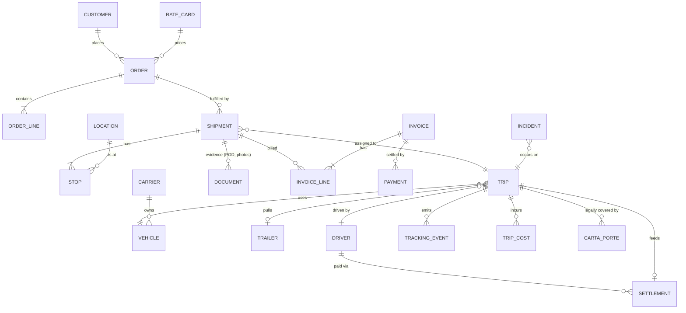

# TMS Domain Model — Entities, States, Modules, MVP Slicing

> Hypothesis document. Anything marked **(H)** must be validated through interviews/assignments before it is locked.

## 1. Who is the customer? (decide first — changes everything)
| Candidate | Core pain | What they pay for | Complexity |
|---|---|---|---|
| **A. Mid-size carrier (10–200 trucks)** (H: best wedge) | Carta Porte, driver settlements, billing, tracking, theft | Compliance + less admin + cash flow | Medium |
| B. Owner-operator network | Finding loads, paperwork, payment speed | Marketplace + simple app | Low per user, high CAC |
| C. Shipper with private fleet | Visibility, cost, ERP integration | Control tower | High integrations |
| D. 3PL / broker | Carrier network, margins, SLAs | Procurement + tendering | High |
| E. Last-mile courier | Stops/hour, failed delivery, POD | Route optimization | Very high volume |

Rule: **choose one primary user for v1**; design the data model so others can be added.

## 2. Core entities

Notes:
- **Order ≠ Shipment ≠ Trip.** Order = customer intent; Shipment = a movement of goods (pickup→delivery); Trip = a truck's journey that may carry several shipments (LTL/milk-run) or one shipment may span several trips (transfer/relay).
- **Stop** has type (pickup/delivery/transfer/border/fuel/rest), planned & actual times, geofence, required docs.
- **Location** must be fiscal-grade: RFC, street, SAT postal code/colony, geocoordinates, dock hours, access notes.
- **Vehicle** attributes: plates, SAT config, year, tare weight, axles, permit number, insurance policy + expiry, GPS device, fuel type, capacity, status.
- **Driver**: RFC/CURP, federal license type + expiry, medical exam expiry, hours-of-service clock, pay scheme, bank info.
- **Trip cost**: category (fuel, toll, viáticos, maintenance, maniobras, fines, other), planned vs actual, source (receipt, card, API).
- **Event sourcing** recommended for tracking and status: store immutable events; derive current state.

## 3. Shipment/trip state machine (simplified)
```
Order:    Draft → Confirmed → Planned → In execution → Delivered → Closed        (Cancelled / On hold at many points)
Trip:     Planned → Assigned → Docs ready → Dispatched → In transit → At stop ⇄ In transit → Completed
Shipment: Pending → Picked up → In transit → Delivered | Refused | Partial | Lost/Stolen
Billing:  Unbilled → Ready (POD ok) → Invoiced → Paid (REP issued) / Disputed
Settlement: Open → Calculated → Approved → Paid
Compliance gates: cannot go "Dispatched" without valid Carta Porte; cannot "Invoice" without POD (configurable).
```
**Exceptions** are modeled explicitly: delay, deviation, breakdown, accident, theft, refusal, damage, shortage, wrong address, closed dock, customs hold, driver unfit, document rejected.

## 4. Modules (and the question each answers)
| # | Module | Key question | MVP? |
|---|---|---|---|
| 1 | Master data (customers, locations, vehicles, drivers, carriers) | Who/what/where? | ✅ |
| 2 | Orders & quoting/rating | What is requested, at what price? | ✅ basic |
| 3 | Planning & dispatch | Which truck/driver, when? | ✅ manual + rules |
| 4 | **Compliance (Carta Porte, permits, hours-of-service)** | Is this trip legal? | ✅ **core** |
| 5 | Tracking & monitoring | Where is it? Is it safe? | ✅ GPS integration |
| 6 | Driver app (offline, WhatsApp bridge) | What does the driver do next? | ✅ light |
| 7 | POD & documents | Proof it was delivered | ✅ |
| 8 | Costs, advances & driver settlements | What did the trip really cost? | ✅ |
| 9 | Billing & AR (CFDI ingreso, REP) | Did we bill and collect? | ✅ or integrate |
| 10 | Fleet & maintenance | Is the truck available/safe? | later (or integrate) |
| 11 | Carrier management & tendering | Who can we subcontract? | later |
| 12 | Security & risk | Is the route/stop risky? | ✅ basic rules |
| 13 | Analytics & KPIs | Are we profitable? | ✅ basic |
| 14 | Customer portal / notifications | Where's my shipment? | later |
| 15 | Integrations hub (ERP, WMS, GPS, PAC, banks, fuel/toll) | How do systems talk? | ✅ PAC + 1 GPS |
| 16 | Optimization (VRP, load consolidation) | What's the best plan? | later |

## 5. Suggested MVP slicing (H) for a mid-size carrier
**Slice 1 – "Legal trip":** masters → order → assign truck/driver → Carta Porte stamped → PDF/QR to driver.
**Slice 2 – "Visible trip":** GPS ingestion, status events, ETA with fatigue rules, alerts, POD upload.
**Slice 3 – "Paid trip":** costs/advances, driver settlement, invoice + payment complement, AR dashboard.
**Slice 4 – "Safe & smart":** route risk, geofences, incident workflow, analytics, subcontracted carriers.
**Slice 5 – "Scale":** customer portal, EDI/API, optimization, marketplace.

## 6. Non-functional requirements
- **Reliability:** PAC outage and GPS outage must degrade gracefully; queue and retry.
- **Offline:** driver app caches trip docs; syncs later.
- **Security:** role-based access, immutable audit logs, encryption at rest, driver personal data (Mexican data-protection law, LFPDPPP [K]), location privacy.
- **Multi-tenant** with per-tenant fiscal config (RFCs, PAC credentials, catalogs).
- **Localization:** Spanish-first, MXN default with USD for cross-border, time zones & DST rules vary by region in Mexico [K].
- **Time handling:** store UTC + local zone; Carta Porte requires local date-times.
- **Performance:** thousands of GPS pings/min; design ingestion separately from OLTP.
- **Observability:** every compliance-relevant action traceable to user, time, source data.
- **Data sovereignty & retention:** fiscal documents retention (years) [K verify].
- **Extensibility:** configurable rules (company policies) vs hardcoded law; law versions change.

## 7. Integration map
| System | Direction | Notes |
|---|---|---|
| PAC (stamping) | out/in | Mandatory; multiple providers; abstract behind adapter |
| GPS/telematics vendors | in | Heterogeneous APIs; normalize to common event schema |
| ERP/accounting (SAP, Oracle, CONTPAQi, Aspel, Odoo…) | both | Local accounting packages common in SMEs [K] |
| WMS / OMS / e-commerce | in/out | Orders, dock appointments |
| Toll/fuel card providers | in | Cost capture |
| Maps/routing | out | Distance, ETA, toll estimate |
| Banks / payment | out | Settlement payouts, reconciliation |
| Insurers | out | Policy data, incident reports |
| Customs broker systems | both | Pedimento/DODA references |
| WhatsApp Business API | both | Driver comms |
| SAT verification | out | QR verification, RFC validation, 69-B checks |
